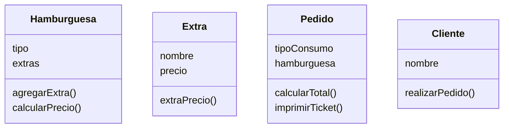

<!-- 1. Crear el archivo ejercicio_01.md en la carpeta retos_sesion_01 y realiza el Análisis y el Diagrama de clases para lo siguiente el siguiente escenario: -->

Un restaurante quiere ofrecer hamburguesas
Los clientes pueden elegir entre hamburguesa de: res, pollo o vegetariana.
Los clientes pueden agregar extras como: lechuga, tomate, 
cebolla y mayonesa
Ademas los clientes pueden decidir comer en el restaurante 
o llevar su pedido

Diseño:

Clases:
- Hamburguesa:
    - Nombre: Hamburguesa
    - Atributos:
        - tipo
        - extras
    - Métodos:
        - agregarExtra()
        - calcularPrecio()
- Extra:
    - Nombre: Extra
    - Atributos:
        - nombre
        - precio
    - Métodos:
        - extraPrecio()
- Pedido:
    - Nombre: Pedido
    - Atributos:
        - tipoConsumo
        - hamburguesa
    - Métodos:
        - calcularTotal()
        - imprimirTicket()
- Cliente:
    - Nombre: Cliente
    - Atributos:
        - nombre
    - Métodos:
        - realizarPedido()
