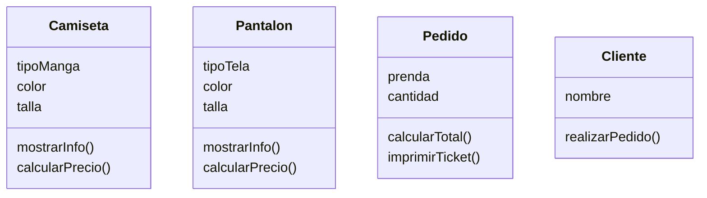

<!-- 2. Crear el archivo ejercicio_02.md en la carpeta retos_sesion_01 y realiza Análisis y el Diagrama de clases para lo siguiente el siguiente escenario: -->

Una tienda de ropa quiere ofrecer camisetas y pantalones
Los clientes pueden elegir entre: camiseta
de manga corta o larga y pantalón de mezclilla o tela
Las camisetas pueden ser de color rojo, azul o verde
y los pantalones de color negro, gris o blanco
Las camisetas tienen las tallas: S, M, L, XL
Los pantalones tienen las tallas desde la 32 hasta la 44

Clases:
- Camiseta:
    - Nombre: Camiseta
    - Atributos:
        - tipoManga ()
        - color ()
        - talla ()
    - Métodos:
        - mostrarInfo()
        - calcularPrecio()
- Pantalon:
    - Nombre: Pantalon
    - Atributos:
        - tipoTela ()
        - color ()
        - talla ()
    - Métodos:
    - mostrarInfo()
    - calcularPrecio()
- Pedido:
    - Nombre: Pedido
    - Atributos:
        - prenda ()
        - cantidad 
    - Métodos:
        - calcularTotal() 
        - imprimirTicket() 
- Cliente: 
    - Nombre: Cliente 
    - Atributos: 
        - nombre
    - Métodos:
        - realizarPedido()
