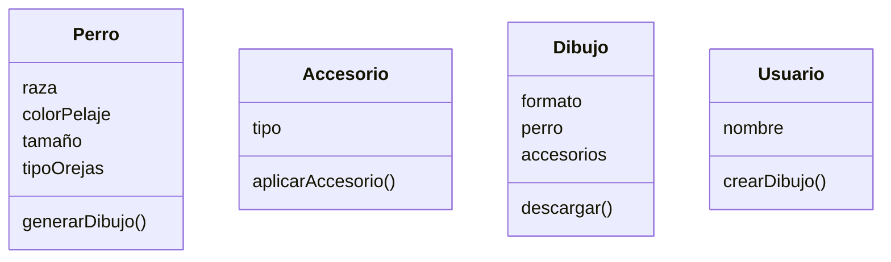

<!-- 3. Crear el archivo ejercicio_03.md en la carpeta retos_sesion_01 y realiza Análisis y el Diagrama de clases para lo siguiente el siguiente escenario: -->

Estas diseñando una app para dibujar de perros con IA 
los usuarios pueden seleccionar características como 
la raza (por ejemplo, labrador o pastor alemán), el color 
del pelaje, el tamaño y el tipo de orejas.
Además, pueden agregar hasta dos accesorios, como sombreros o gafas.
El dibujo final puede descargarse en formato PNG o JPG.

Clases:
- Perro:
    - Nombre: Perro
    - Atributos:
        - raza (labrador | pastor alemán |)
        - colorPelaje
        - tamaño
        - tipoOrejas
    - Métodos:
        - generarDibujo()
- Accesorio:
    - Nombre: Accesorio
    - Atributos:
        - tipo (sombrero | gafas)
    - Métodos:
        - aplicarAccesorio()
- Dibujo:
    - Nombre: Dibujo
    - Atributos:
        - formato (PNG | JPG)
        - perro
        - accesorios (máx. 2)
    - Métodos:
        - descargar()
- Usuario:
    - Nombre: Usuario
    - Atributos:
        - nombre
    - Métodos:
        - crearDibujo()
