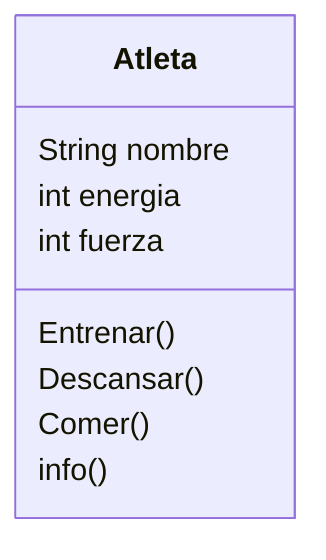

<!--
1.
    Imagina un juego de rol en el que el personaje principal es un atleta.

Este personaje tiene tres atributos principales:

    nombre: identifica al atleta
    energía: representa su nivel de energía actual.
    fuerza: indica su capacidad física.
Cada atleta puede realizar las siguientes acciones:

    Entrenar: aumenta su fuerza, pero consume energía.
    Descansar: recupera energía.
    Comer: solo puede consumir hamburguesas, lo que también le ayuda a recuperar energía.

    Realiza el análisis y diagrama de clases de la clase Atleta en el archivo ejercicio_01.md.
    Escribe el codigo en Python para la clase Atleta en el archivo ejercicio_01.py.
    Implementa los métodos de instancia, clase y estáticos según corresponda.
    Instancia dos Atletas y prueba sus métodos. 
-->

- Requisitos:
    - Registrar atletas.
    - Aumentar fuerza y consumir energía al entrenar.
    - Recuperar energía al descansar.
    - Comer hamburguesas para recuperar energía.
- Objetos:
    - Atleta
- Características:
    - Atleta: Nombre, Energía, Fuerza
- Acciones:
    - Atleta: Entrenar, Descansar, Comer, informacion

