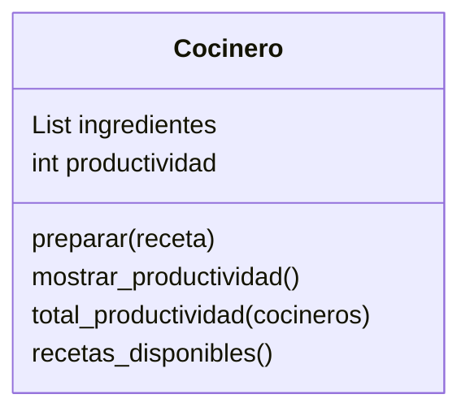

<!-- 
2
    Imagina un sistema que modela el trabajo de cocineros en una cocina profesional.

Cada cocinero tiene tres elementos clave:

    Una lista de ingredientes disponibles.
    Un conjunto de recetas definidas que puede preparar
    Un contador de productividad, que aumenta cada vez que prepara una receta con éxito. Si hay más de un cocinero, sus puntos individuales pueden sumarse para obtener una métrica agregada de productividad.
Las únicas recetas permitidas en el sistema son:
Receta 	Ingredientes Requeridos
pan 	harina, agua
pizza 	harina, agua, sal, tomate, queso
galleta 	harina, agua, sal, chocolate

Realiza el análisis y diagrama de clases de la clase Cocinero en el archivo ejercicio_02.md.
Escribe el codigo en Python para la clase Cocinero en el archivo ejercicio_02.py.
Implementa los métodos de instancia, clase y estáticos según corresponda.
Instancia tres Cocineros y prueba sus métodos.
Muestra la métrica agregada de productividad. 
-->

- Requisitos:
    - Registrar cocineros.
    - Almacenar sus ingredientes.
    - Preparar recetas solo si se tienen los ingredientes necesarios.
    - Incrementar productividad al preparar recetas exitosas.
    - Calcular la productividad total de todos los cocineros.
- Objetos:
    - Cocinero
- Características:
    - Cocinero: Ingredientes disponibles, Productividad
- Acciones:
    - Cocinero: Preparar receta, Ver productividad individual, Calcular productividad total

