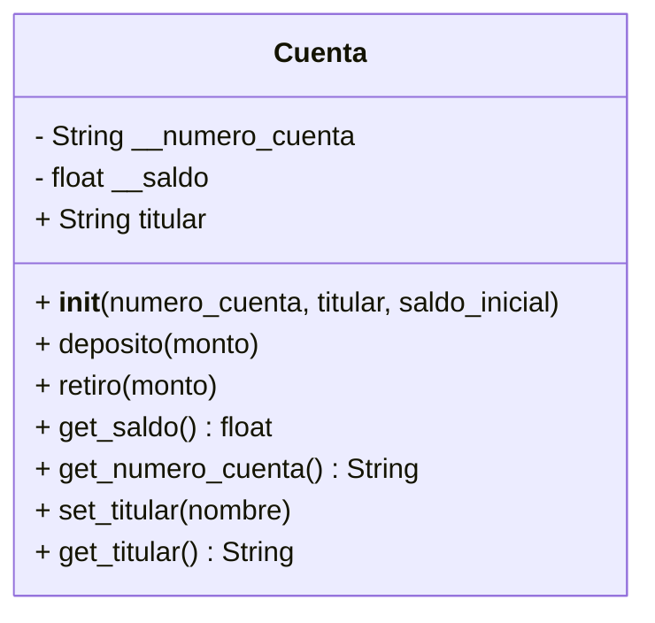

<!-- 1
    Un banco necesita desarrollar un módulo para gestionar cuentas bancarias. Cada cuenta tiene las siguientes caracteristicas:

    saldo: Es un dato privado. Solo puede consultar. Se puede modificar únicamente a través de deposito y retiro
    deposito: Permite ingresar dinero, incrementando el saldo.
    retiro: Permite retirar dinero, siempre y cuando el saldo disponible sea suficiente.

    número de cuenta: Es privado. Puede consultarse, pero no puede modificarse una vez asignado.
    nombre del titular: Es público. Puede consultarse y modificarse libremente.

    Realiza el análisis y diagrama de clases de la clase Cuenta en el archivo ejercicio_01.md.
    Escribe el codigo en Python para la clase Cuenta en el archivo ejercicio_01.py.
    Implementa encapsulamiento para proteger los atributos sensibles
    Utiliza getters y setters para controlar el acceso y la modificación de los atributos.
    Propiedades para ofrecer una interfaz clara y segura al usuario del sistema.
 -->

- Requisitos:
    - Registrar cuentas bancarias.
    - El número de cuenta y el saldo deben ser privados.
    - El saldo solo puede modificarse mediante depósito o retiro.
    - El número de cuenta puede consultarse pero no modificarse.
    - El nombre del titular puede consultarse y modificarse libremente.
    - Implementar propiedades para ofrecer una interfaz clara y segura.
- Objetos:
    - Cuenta
- Características:
    - Cuenta
        - número de cuenta (privado, solo lectura)
        - saldo (privado, lectura controlada, modificado mediante depósito/retiro)
        - nombre del titular (público, lectura y escritura)
- Acciones:
    - Depositar dinero
    - Retirar dinero
    - Consultar saldo
    - Consultar número de cuenta

