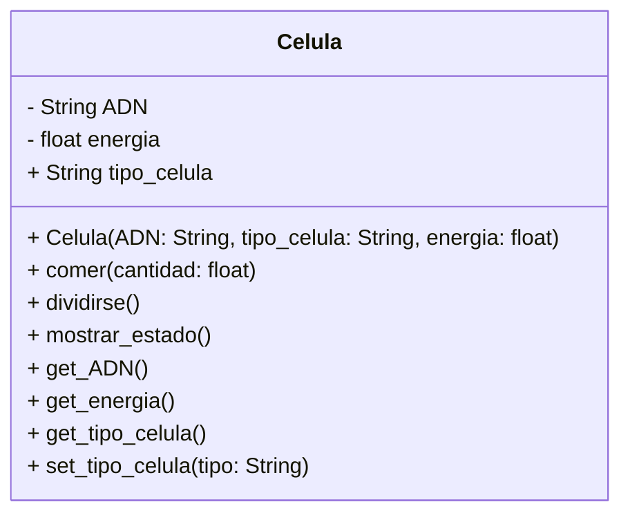

<!-- 2
    Un médico necesita simular el comportamiento de una célula. Cada célula debe cumplir con las siguientes características:

    ADN: Se puede consultar pero no puede cambiar.
    tipo de célula: Puede consultarse y modificarse libremente.
    energía: Es un dato privado. Puede aumentar o disminuir, únicamente mediante las acciones de comer o dividirse.

    
    Realiza el análisis y el diagrama de clases de la clase Celula en el archivo ejercicio_02.md.
    Escribe el código en Python para la clase Celula en el archivo ejercicio_02.py.
    Implementa encapsulamiento para proteger los atributos sensibles.
    Utiliza getters y setters para controlar el acceso y la modificación de los atributos.
    Aplica propiedades para ofrecer una interfaz clara y segura al usuario del sistema. 
-->
- Requisitos:
    - Simular el comportamiento de una célula.
    - El ADN debe ser privado y solo consultable (no puede modificarse).
    - El tipo de célula puede consultarse y modificarse libremente.
    - La energía debe ser privada. Solo puede aumentar o disminuir mediante las acciones de comer o dividirse.
    - Implementar encapsulamiento para proteger los atributos sensibles.
    - Usar getters, setters y propiedades para ofrecer una interfaz clara y segura.
- Objetos:
    - Celula
- Características:
    - Celula
    - ADN (privado, solo lectura)
    - tipo de célula (público, lectura y escritura)
    - energía (privado, modificable solo mediante métodos internos)
- Acciones:
    - Comer (aumenta energía)
    - Dividirse (disminuye energía)
    - Consultar ADN
    - Consultar o modificar tipo de célula
    - Consultar energía actual

