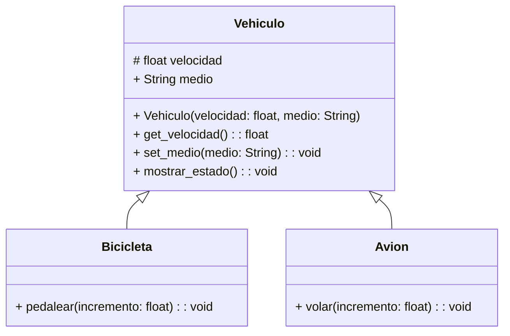

<!-- 
1
     Una empresa de transporte desea desarrollar una simulación que represente el comportamiento de sus distintos vehículos.

 Todo vehículo posee las siguientes características:

     velocidad: Es un dato protegido. Puede consultarse, pero solo modificarse mediante acciones específicas.
     medio: Representa el entorno en el que se desplaza el vehículo (por ejemplo, terrestre, acuático, aéreo). Puede consultarse y modificarse libremente.

 Existen dos tipos de vehículos con características específicas:

     Bicicleta: Incrementar su velocidad mediante la acción de pedalear.
     Avión: Incrementar su velocidad mediante la acción de volar.

     Realiza el análisis y el diagrama de clases de las clases Vehiculo, Bicicleta y Avion en el archivo ejercicio_01.md.
     Escribe el código en Python para las clases Vehiculo, Bicicleta y Avion en el archivo ejercicio_01.py.
     Aplica herencia de manera adecuada para el contexto de este ejercicio. 
-->

- Requisitos:
    - Simular el comportamiento de distintos vehículos pertenecientes a una empresa de transporte.
    - Todos los vehículos tienen velocidad (dato protegido) y medio (dato público).
    - La velocidad puede consultarse, pero solo modificarse mediante acciones específicas.
    - Deben existir dos tipos de vehículos:
        - Bicicleta: puede incrementar su velocidad pedaleando.
        - Avión: puede incrementar su velocidad al volar.
    - Aplicar herencia para reutilizar atributos y métodos comunes entre los vehículos.
- Objetos:
    - Vehiculo
    - Bicicleta
    - Avion
- Características:
    - Vehiculo
        - velocidad: int
        - medio: string
    - Bicicleta
        - Hereda de Vehiculo
        - Acción: int
    - Avion
        - Hereda de Vehiculo
        - Acción: int
- Acciones:
    - Consultar velocidad
    - Modificar medio
    - Pedalear (Bicicleta → aumenta velocidad)
    - Volar (Avión → aumenta velocidad)
