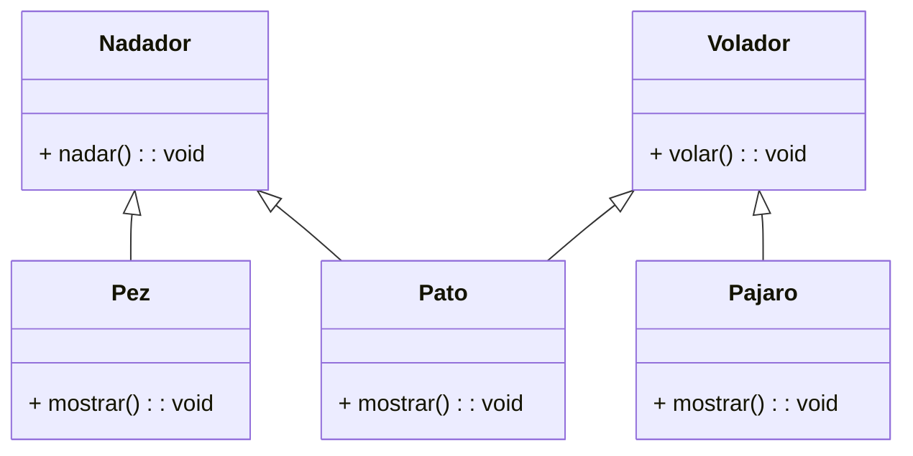

<!-- 2
    Debes desarrollar un videojuego tipo aventura, donde los personajes tiene distintas habilidades

Cada personaje pertenece a uno o más tipos que definen sus comportamientos:

    Nadador: Puede ejecutar la acción nadar(), que representa la acción de desplazarse en el agua.
    Volador: Puede ejecutar la acción volar(), que representa la acción de desplazarse por el aire.

En el juego existen tres personajes principales, cada uno con habilidades específicas:

    Pez: tiene la habilidad de nadar.
    Pájaro: tiene la habilidad de volar.
    Pato: tiene ambas habilidades, puede nadar y volar.

Cada personaje debe contar con un método mostrar() que indique el tipo de personaje y su habilidad principal o combinada.

    Realiza el análisis y diagrama de clases de las clases Nadador, Volador, Pez, Pajaro y Pato en el archivo ejercicio_02.md.
    Escribe el código en Python de las clases Nadador, Volador, Pez, Pajaro y Pato en el archivo ejercicio_02.py.
    Aplica herencia múltiple de manera adecuada para el contexto de este ejercicio.
    Utiliza un método mostrar() en cada clase para identificar al personaje y sus habilidades.
 -->

- Requisitos:
    - Desarrollar un videojuego de aventura con distintos personajes y habilidades.
    - Los personajes pueden tener la habilidad de nadar, volar o ambas.
    - Cada habilidad debe implementarse en una clase base independiente (Nadador y Volador).
    - Los personajes principales son:
        - Pez: puede nadar.
        - Pájaro: puede volar.
        - Pato: puede nadar y volar (herencia múltiple).
    - Cada personaje debe tener un método mostrar() que indique su tipo y sus habilidades.
- Objetos:
    - Nadador
    - Volador
    - Pez
    - Pajaro
    - Pato
- Características:
    - Nadador
        - Acción: nadar() 
    - Volador
        - Acción: volar() 
    - Pez
        - Hereda de Nadador.
        - Acción: nadar().
        - Método: mostrar()
    - Pajaro
        - Hereda de Volador.
        - Acción: volar().
        - Método: mostrar()
    - Pato
        - Hereda de Nadador y Volador (herencia múltiple).
        - Acciones: nadar() y volar().
        - Método: mostrar()
- Acciones:
    - nadar()
    - volar()
    - mostrar()
