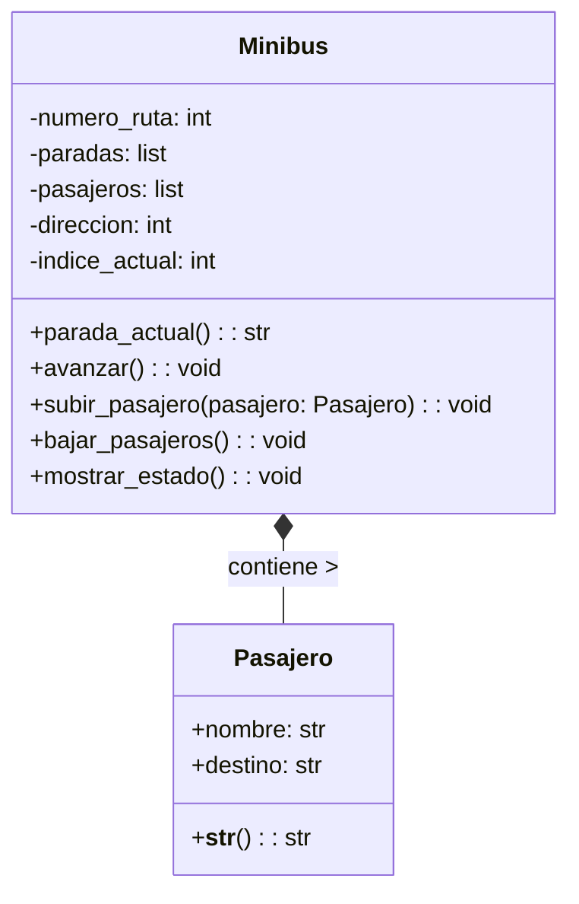

<!-- 
En su trayecto diario al trabajo, las personas pueden abordar distintos minibuses. Cada minibus está identificado por un número de ruta y sigue un recorrido compuesto por varias paradas (ubicaciones). Por otro lado, cada pasajero tiene un nombre y una ubicación de destino a la que desea llegar.

Los pasajeros pueden subir o bajar del minibus en cualquier parada, pero bajo las siguientes condiciones:

    Un pasajero solo puede subir si el recorrido del minibus incluye su destino entre las paradas programadas.
    Un pasajero solo puede bajar si la parada actual del minibus coincide con su destino.
    Las paradas son circulares: al llegar al final del recorrido, el minibus invierte su lista de paradas y regresa en sentido contrario.

    Diseñar las clases necesarias para representar Minibus y Pasajero.
    Toma en cuenta las siguientes características:
        Un minibus tiene una lista de paradas programadas (ejemplo: ["Arce", "Prado", "Perez"]).
        Un minibus puede transportar múltiples pasajeros.
    Simular el movimiento del minibus entre paradas y las acciones de subida y bajada de pasajeros.

    Realiza el análisis y diagrama de clases para las clases Minibus y Pasajero en el archivo ejercicio_01.md.
    Escribe el código en Python para las clases Minibus y Pasajero en el archivo ejercicio_01.py.
    Aplica los principios de relaciones entre las clases (composición o agregación según corresponda).

    Asegúrate de que las clases incluyan atributos y métodos coherentes con su propósito.
    Utiliza buenas prácticas de nomenclatura, encapsulamiento y legibilidad. 
-->

- Requisitos:
    - Simular el recorrido de un minibús con varias paradas.
    - Los pasajeros pueden subir o bajar dependiendo de su destino y la parada actual.
    - El recorrido es circular, es decir, cuando el minibús llega al final, invierte el sentido de las paradas y regresa.
    - Solo pueden subir pasajeros cuyo destino esté en la lista de paradas.
    - Solo pueden bajar cuando la parada actual coincide con su destino.
    - El minibús puede transportar varios pasajeros a la vez.

- Objetos:
    - Minibus
    - Pasajero

- Características:
    - Clase: Pasajero
        - Atributos:
            - nombre (público): identifica al pasajero.
            - destino (público): indica la parada donde desea bajar.
        - Métodos:
            __str__(): retorna una representación legible del pasajero (nombre + destino).
    - Clase: Minibus
        -   Atributos:
            - _numero_ruta (protegido): número identificador de la ruta.
            - _paradas (lista protegida): lista de paradas programadas.
            - _pasajeros (lista privada): pasajeros actualmente a bordo.
            - _direccion (privado): indica si el bus va hacia adelante o en sentido inverso.
            - _indice_actual (privado): posición actual en la lista de paradas.
        - Métodos:
            - parada_actual(): devuelve la parada en la que se encuentra el minibús.
            - avanzar(): mueve el minibús a la siguiente parada; si llega al final, invierte el sentido.
            - subir_pasajero(pasajero): agrega un pasajero si su destino está en la lista de paradas.
            - bajar_pasajeros(): baja los pasajeros cuyo destino coincide con la parada actual.
            - mostrar_estado(): imprime la parada actual y los pasajeros a bordo.
    - Relación entre clases:
        - Composición:El Minibus contiene a los objetos Pasajero (los pasajeros existen dentro del contexto del minibús).

