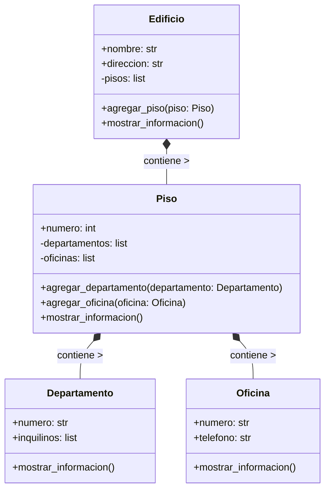

<!-- 2
Se debe modelar un edificio ubicado en la ciudad de La Paz, compuesto por 3 pisos. Cada piso contiene una combinación de departamentos y oficinas

    Cada departamento tiene un número que comienza con el número del piso seguido de un número de unidad (por ejemplo: 201, 304).
    Cada oficina tiene un número que comienza con el número del piso seguido de una letra (por ejemplo: 2A, 3C).
Además:

    El edificio tiene direccion y nombre.
    Los pisos tienen un atributo numero
    Las oficinas cuentan con un atributo telefono.
    Los departamentos tienen un atributo inquilinos.
El sistema debe permitir:

    Crear un edificio con sus pisos correspondientes.
    Agregar departamentos y oficinas a cada piso.
    Acceder y mostrar la información del edificio de forma organizada y jerárquica

    Realiza el análisis y diagrama de clases de las clases Edificio, Piso, Departamento y Oficina en el archivo ejercicio_02.md.
    Escribe el código en Python de las clases Edificio, Piso, Departamento y Oficina en el archivo ejercicio_02.py.
    Implementa relaciones jerárquicas entre objetos:
        Un edificio contiene varios pisos.
        Cada piso contiene varios departamentos y oficinas
    Aplica los principios de relaciones entre las clases (composición o agregación según corresponda).
    Utiliza atributos y métodos adecuados para representar y mostrar la información de cada entidad.
    Utiliza buenas prácticas de nomenclatura, encapsulamiento y legibilidad. 
-->

- Requisitos:
    - Modelar un edificio con 3 pisos en la ciudad de La Paz.
    - Cada piso puede tener departamentos y oficinas.
    - Las oficinas y departamentos se numeran en función del piso.
    - Las oficinas tienen un número (por ejemplo, 2A) y un teléfono.
    - Los departamentos tienen un número (por ejemplo, 201) y una lista de inquilinos.
    - Se debe poder crear el edificio, agregar pisos, departamentos y oficinas, y mostrar toda la información organizada.
- Objetos:
    - Edificio
    - Piso
    - Departamento
    - Oficina
- Características:
    - Clase: Edificio
        - Atributos:
            - nombre (público): nombre del edificio.
            - direccion (público): dirección del edificio.
            - _pisos (privado): lista de pisos.
        - Métodos:
            - agregar_piso(piso): agrega un piso al edificio.
            - mostrar_informacion(): muestra de forma jerárquica toda la estructura del edificio.
    - Clase: Piso
        - Atributos:
            - numero (público): número de piso.
            - _departamentos (privado): lista de departamentos.
            - _oficinas (privado): lista de oficinas.
        - Métodos:
            - agregar_departamento(departamento): agrega un departamento al piso.
            - agregar_oficina(oficina): agrega una oficina al piso.
            - mostrar_informacion(): muestra los departamentos y oficinas del piso.
    - Clase: Departamento
        - Atributos:
            - numero (público): número del departamento (ejemplo: 201, 302).
            - inquilinos (público): lista con los nombres de los inquilinos.
        - Métodos:
            - mostrar_informacion(): muestra los datos del departamento.
    - Clase: Oficina
        - Atributos:
            - numero (público): número de la oficina (ejemplo: 2A, 3C).
            - telefono (público): número de teléfono asociado.
        - Métodos:
            - mostrar_informacion(): muestra los datos de la oficina.
- Relaciones entre clases:
    - Composición:
        - Un Edificio contiene varios Pisos.
        - Cada Piso contiene varios Departamentos y Oficinas.            

