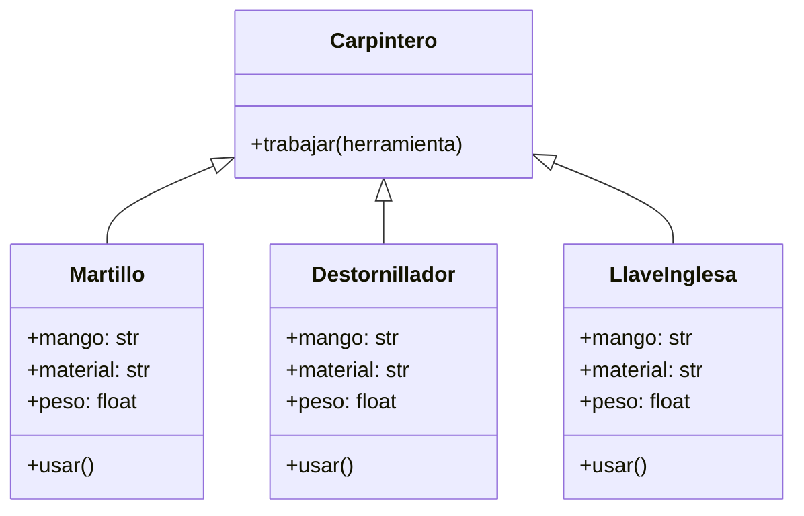

<!-- 
    En un taller de carpintería, los trabajadores utilizan diferentes herramientas para construir muebles, reparar objetos o ajustar piezas.
    Cada herramienta tiene una función específica, pero todas pueden ser utilizadas por el carpintero de manera similar.

Por ejemplo:

    El martillo se usa para clavar clavos
    El destornillador se usa para ajustar tornillos
    La llave inglesa se usa para apretar tuercas

El carpintero no necesita saber el tipo exacto de herramienta que está utilizando, solo necesita que la herramienta pueda ejecutar la acción usar()

    Crea las clases necesarias para representar las herramientas: Martillo, Destornillador y LlaveInglesa.
    Cada clase debe implementar su propio comportamiento en el método usar().

    Realiza el análisis y diagrama de clases para las clases Martillo, Destornillador y LlaveInglesa en el archivo ejercicio_01.md
    Escribe el código en Python para las clases de tu diagrama de clases utilizando duck typing en el archivo ejercicio_01.py

    Asegúrate de que las clases incluyan atributos y métodos coherentes con su propósito (por ejemplo, tipo de mango, material, peso).
    Utiliza buenas prácticas de nomenclatura, encapsulamiento y legibilidad.
    Implementa un ejemplo de uso donde el carpintero interactúe con distintas herramientas sin conocer su tipo específico. 
-->
- Requisitos:
    - Modelar un sistema para un taller de carpintería.
    - Cada herramienta tiene atributos como tipo de mango, material y peso.
    - Todas las herramientas deben implementar el método usar(), que describe su función principal.
    - El carpintero puede usar cualquier herramienta sin importar su tipo, siempre que tenga un método usar() (principio de Duck Typing).
    - Implementar ejemplos con Martillo, Destornillador y Llave Inglesa.
- Objetos:
    - Martillo
    - Destornillador
    - LlaveInglesa
    - Carpintero (usa herramientas, sin conocer su tipo)
- Características:
    - Herramientas (comunes)
        - Atributos:
            - mango (público): tipo de mango (madera, plástico, goma).
            - material (público): material principal de la herramienta.
            - peso (público): peso aproximado en kilogramos.
        - Métodos:
            - usar(): comportamiento específico según la herramienta.
    - Martillo
        - Método: usar() → imprime “Clavando clavos con fuerza.”
    - Destornillador
        - Método: usar() → imprime “Ajustando tornillos con precisión.”
    - LlaveInglesa
        - Método: usar() → imprime “Apretando tuercas con cuidado.”
    - Carpintero
        - Método: trabajar(herramienta) → llama al método usar() de cualquier objeto que lo implemente (duck typing).
- Relaciones entre clases:
    - El Carpintero usa las herramientas (agregación simple).
    - No hay herencia directa, se utiliza duck typing para compartir comportamiento.

