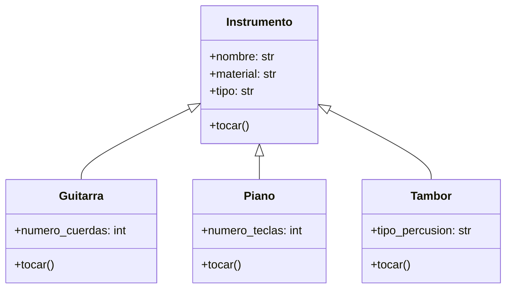

<!-- 
    Una aplicación de aprendizaje musical permite a los usuarios practicar con distintos instrumentos Cada instrumento tiene una forma particular de producir sonido, pero todos pueden ser tocados por el usuario mediante una acción común.

Por ejemplo:

    La guitarra hace "strum"
    El piano hace "plin"
    El tambor hace "boom"
Aunque cada instrumento suena distinto, todos comparten una característica común:
pueden ejecutar la acción tocar()

    Crea una clase base llamada Instrumento que defina el método tocar().
    Identifica atributos y métodos relevantes para cada instrumento, considerando su función y comportamiento.
    Implementa las clases derivadas Guitarra, Piano y Tambor, cada una con su propia versión del método tocar() que imprima su sonido característico.
    Realiza el análisis y el diagrama de clases para Instrumento, Guitarra, Piano y Tambor en el archivo ejercicio_02.md
    Escribe el código en Python para las clases de tu diagrama de clases en el archivo ejercicio_02.py
    Asegúrate de que las clases incluyan atributos y métodos coherentes con su propósito (por ejemplo, número de cuerdas, tipo de percusión, material).
    Utiliza buenas prácticas de nomenclatura, encapsulamiento y legibilidad
    Implementa un ejemplo de uso donde un usuario interactúe con distintos instrumentos sin preocuparse por su tipo específico. 
-->
- Requisitos:
    - Crear una aplicación de aprendizaje musical que permita a los usuarios practicar con distintos instrumentos.
    - Cada instrumento tiene su propio sonido característico, pero todos comparten la acción común tocar().
    - Debe aplicarse herencia y polimorfismo, utilizando una clase base llamada Instrumento.

- Objetos:
    - Instrumento
    - Guitarra
    - Piano
    - Tambor

- Características:
    - Instrumento
        - nombre (público): nombre del instrumento.
        - material (público): material principal del instrumento.
        - tipo (público): tipo de instrumento (cuerda, teclado, percusión, etc.).
        - tocar(): método común que será redefinido por las subclases.
    - Guitarra
        - número de cuerdas (público): cantidad de cuerdas.
        - tocar(): imprime el sonido característico “strum”.
    - Piano
        - número de teclas (público): cantidad de teclas.
        - tocar(): imprime el sonido característico “plin”.
    - Tambor
        - tipo de percusión (público): tipo de superficie o técnica de percusión.
        - tocar(): imprime el sonido característico “boom”.
- Acciones:
    - Tocar el instrumento (polimórfico en cada clase derivada).
    - Mostrar información del instrumento al ejecutarse el método tocar().
    - Permitir que un usuario practique con diferentes instrumentos sin importar su tipo (polimorfismo).

