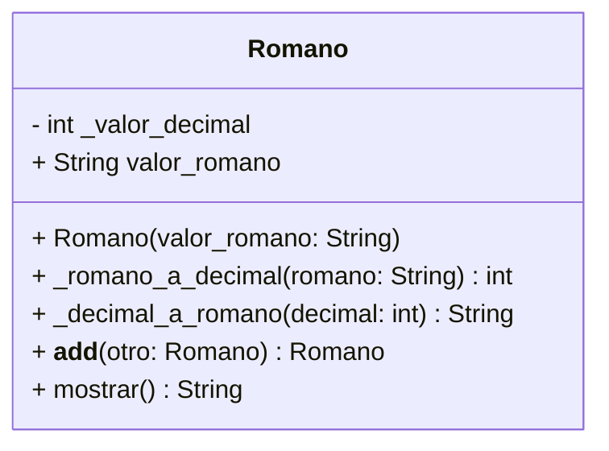

<!-- 
    Un profesor de matemáticas utiliza una calculadora de números romanos para enseñar aritmética clásica. Cada número se representa mediante una letra o combinación de letras romanas, como:

    I = 1
    V = 5
    X = 10
    L = 50
    C = 100

Crea la clase Romano que permita sumar números romanos usando el operador +
    num1 = Romano("X")   # 10  
    num2 = Romano("V")   # 5
    resultado = num1 + num2
El resultado debe ser un nuevo objeto de tipo Romano con el valor "XV" (equivalente a 15).

Esto se logra mediante la sobrecarga del operador +, definiendo su comportamiento dentro de la clase Romano.

    Realiza el análisis y diagrama de clases para las clase Romano en el archivo ejercicio_03.md.
    Escribe el código en Python para las clases Romano en el archivo ejercicio_03.py.
    Asegúrate de que las clases incluyan atributos y métodos coherentes con su propósito
    Utiliza buenas prácticas de nomenclatura, encapsulamiento y legibilidad 
-->
- Requisitos:
    - Crear una clase Romano que represente números en formato romano.
    - Implementar la sobrecarga del operador + para permitir la suma entre dos objetos Romano.
    - El resultado debe ser un nuevo objeto Romano con el valor romano resultante.
    - Implementar métodos para:
        - Convertir de número romano a decimal.
        - Convertir de decimal a número romano.
        - Mostrar el valor en ambos formatos.
    - Aplicar polimorfismo mediante la redefinición del método mostrar() para representar los objetos de forma uniforme.
    - Usar encapsulamiento, buenas prácticas y legibilidad.

- Objetos:
    - Romano

- Características:
    - Romano
        - valor_romano (string) → representación en números romanos
        - _valor_decimal (int, privado) → valor decimal equivalente

- Acciones:
    - Convertir de romano a decimal
    - Convertir de decimal a romano
    - Sumar dos números romanos (__add__)
    - Mostrar valor (polimórfico con mostrar())

