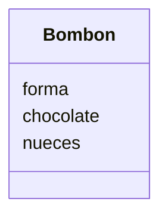

Copia el siguiente diseño y 
crea un diagrama de una clase

# Diseño:

Clases:
- Bombon 🧆:
    - Nombre: Bombon
    - Atributos:
        - forma
        - chocolate
        - nueces
    - Métodos:
        - (No hay métodos)

