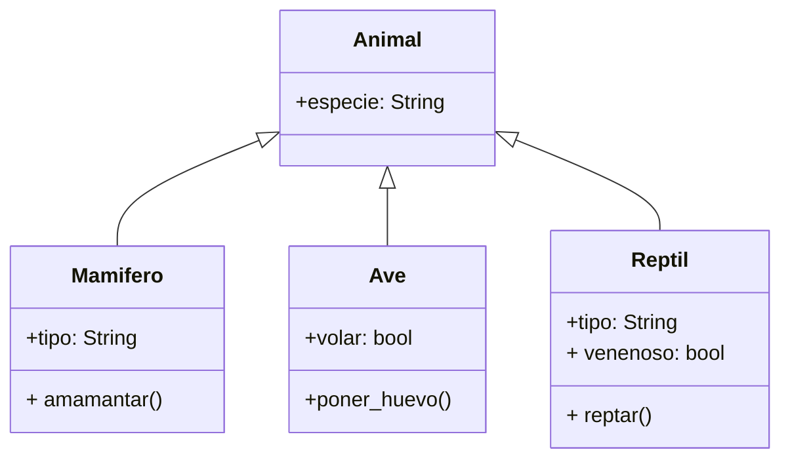

<!-- Un zoológico posee un catálogo digital de animales
Existen dos categorías principales: mamíferos y aves
Los animales tienen registrado la especie a la que pertenecen
Los mamíferos puede ser de dos tipos: terrestres o acuáticos
y puede amamantar a crías
Las aves tienen la característica de poder volar o no
y tienen la capacidad de poner huevos

# Análisis
Requisitos:
- Registrar animales
- Almacenar información de especie
- Categorías principales mamíferos y aves
- Mamíferos son animales
- Mamíferos son terrestres o acuáticos
- Mamíferos pueden amamantar
- Aves son animales
- Aves pueden volar o no
- Aves pueden poner huevos

Objetos:
- Animal (clase padre)
- Mamífero (clase hija)
- Ave (clase hija)

Características:
- Animal:
  - especie: String
- Mamífero:
  - tipo: String (terrestre, acuático)
- Ave:
  - volar: bool

Acciones:
- Animal:
  - (sin acciones)
- Mamífero:
  - amamantar()
- Ave:
  - poner_huevo() -->

<!-- ```mermaid -->
<!-- classDiagram
class Animal {
        +especie: String
    }
    class Mamifero {
        +tipo: String
        + amamantar()
    }
    class Ave {
        +volar: bool
        +poner_huevo()
    }
    Animal <|-- Mamifero
    Animal <|-- Ave -->
<!-- ``` -->

<!-- ---------------------------------------- -->
	 Análisis Mejorado 
Requisitos:
- Registrar animales
- Almacenar información de especie
- Categorías principales mamíferos, aves y reptiles
- Mamíferos son animales
- Mamíferos son terrestres o acuáticos
- Mamíferos pueden amamantar
- Aves son animales
- Aves pueden volar o no
- Aves pueden poner huevos
- Reptiles son animales
- Reptiles pueden ser terrestres o acuáticos
- Reptiles pueden ser venenosos o no
- Reptiles pueden reptar
Objetos:
- Animal (clase padre)
- Mamífero (clase hija)
- Ave (clase hija)
- Reptil (clase hija)
Características:
- Animal:
  - especie: String
- Mamífero:
  - tipo: String (terrestre, acuático)
- Ave:
  - volar: bool
- Reptil:
  - tipo: String (terrestre, acuático)
  - venenoso: bool
Acciones:
- Animal:
  - (sin acciones)
- Mamífero:
  - amamantar()
- Ave:
  - poner_huevo()
- Reptil:
    - reptar()


